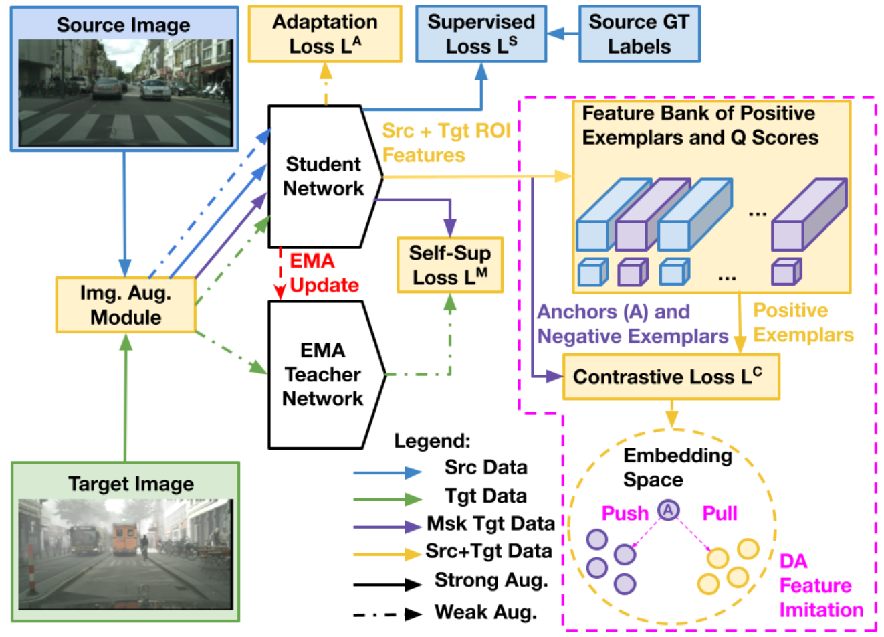
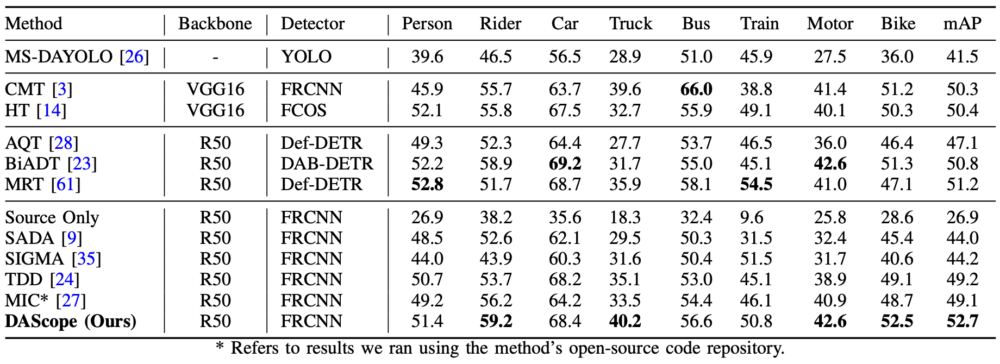
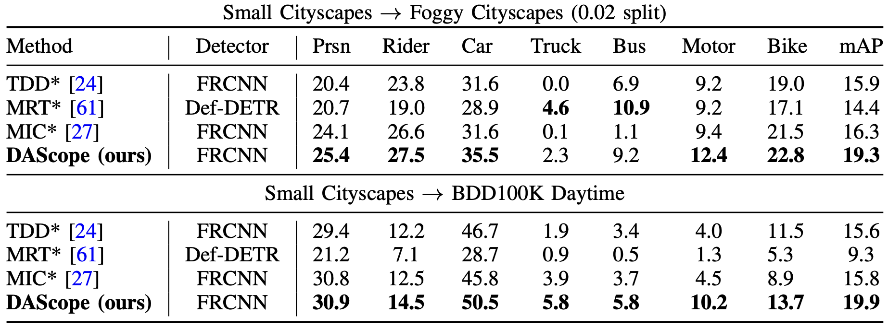
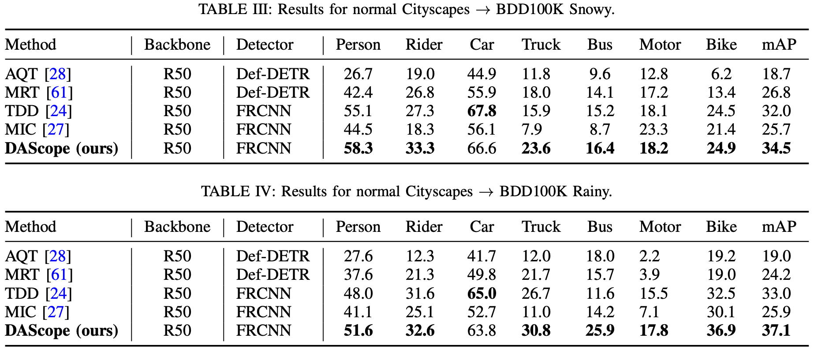

# Domain Adaptive Object Detection via Self-Supervised Feature Learning

## DAScope

Domain adaptive object detection (DAOD) aims to classify and locate objects in a scene when domain gaps exist between the training (source) and testing (target) environments. Existing deep learning models for domain adaptive object detection typically suffer from poor detection performance with small and far-away objects. To address this, we propose DAScope, a novel, small-object-aware, domain adaptive object detection pipeline. The key novelty in our proposed pipeline is a self-supervised feature imitation learning module. Within a mean teacher framework, DAScope extracts object-level feature representations, stores them in a feature bank, and probabilistically samples them to compute a contrastive loss. This contrastive loss improves object-level feature representations, which is particularly effective for detecting small objects. 



Shown below are our results on Cityscapes->Foggy Cityscapes. 



When the datasets have been filtered to contain only small objects, we find that we outperform the same detectors from the normal-sized tasks. Shown below are our results on small-object-only Cityscapes->Foggy Cityscapes.



Furthermore, we demonstrate the effectiveness of DAScope on larger, real-weather induced domain gaps. To perform these experiments, we filtered BDD100K to contain only the snowy and rainy images, and ran the following experiments: Cityscapes->BDD100K Rainy and Cityscapes->BDD100K Snowy.



## Getting started with DAScope

### Installation

Please follow the instruction in [det/INSTALL.md](det/INSTALL.md) to install and use this repo.

For installation problems, please consult issues in [ maskrcnn-benchmark
](https://github.com/facebookresearch/maskrcnn-benchmark).

### Datasets

The datasets used in the repository can be downloaded from the following links:

* [Cityscapes and Foggy Cityscapes](https://www.cityscapes-dataset.com/)
* [BDD100K](https://bdd-data.berkeley.edu/)

The datasets should be organized in the following structure.
```
datasets/
├── cityscapes
│   ├── annotations
│   ├── gtFine
│   └── leftImg8bit
├── foggy_cityscapes
│   ├── annotations
│   ├── gtFine
│   └── leftImg8bit
└── bdd_daytime
    ├── annotations
    └── images
```

All three datasets should be processed with [anno_convert.py](Utils/anno_convert.py) to:
* Convert annotations into the coco format
* Filter both datasets to contain only small objects
* Filter the BDD100K dataset to contain either snowy or rainy images

Filtering all three datasets with [anno_convert.py](Utils/anno_convert.py) to contain only small objects entails creating a second annotation file for each within their respective annotation folders using [anno_convert.py](Utils/anno_convert.py). The images in each dataset are not changed. More details on how to use [anno_convert.py](Utils/anno_convert.py) are described within the file itself. 

## Training

For experiments in our paper, we use the following script to run Cityscapes to Foggy Cityscapes adaptation task:

```shell
python det/tools/train_net.py --config-file "det/configs/daod_ssfi/e2e_da_faster_rcnn_R_50_FPN_masking_cs.yaml"
```

## Testing

The trained model could be evaluated with the following script:
```shell
python det/tools/test_net.py --config-file "det/configs/daod_ssfi/e2e_da_faster_rcnn_R_50_FPN_masking_cs.yaml" MODEL.WEIGHT <path_to_store_weight>
```

## Checkpoints

We provide the models that correspond to each of our experiments [here](https://drive.google.com/drive/folders/1jrTvGe8OenFVxLzw8GrqCEXIDw8It12X?usp=drive_link).

## Where to find DAScope in the code?

The most relevant files for DAScope are:

* [det/configs/daod_ssfi/](det/configs/daod_ssfi/):
  Definition of the experiment configurations in our paper.
* [det/tools/train_net.py](det/tools/train_net.py):
  Training script for UDA with DAScope(MIC + sa-da-faster).
* [det/maskrcnn_benchmark/engine/trainer.py](det/maskrcnn_benchmark/engine/trainer.py):
  Training process for UDA with DAScope(MIC + sa-da-faster).
* [det/maskrcnn_benchmark/modeling/roi_heads/box_head/box_head.py](det/maskrcnn_benchmark/modeling/roi_heads/box_head/box_head.py):
  Implementation of the DAScope feature imitation learning pipeline.
* [det/maskrcnn_benchmark/modeling/teacher.py](det/maskrcnn_benchmark/modeling/teacher.py):
  Implementation of the EMA teacher.

## Acknowledgements

DAScope is based on the following open-source projects. 
We thank their authors for making the source code publicly available.

* [MIC](https://github.com/lhoyer/MIC)
* [CFINet](https://github.com/shaunyuan22/cfinet)
* [sa-da-faster](https://github.com/yuhuayc/sa-da-faster)
* [maskrcnn-benchmark](https://github.com/facebookresearch/maskrcnn-benchmark)